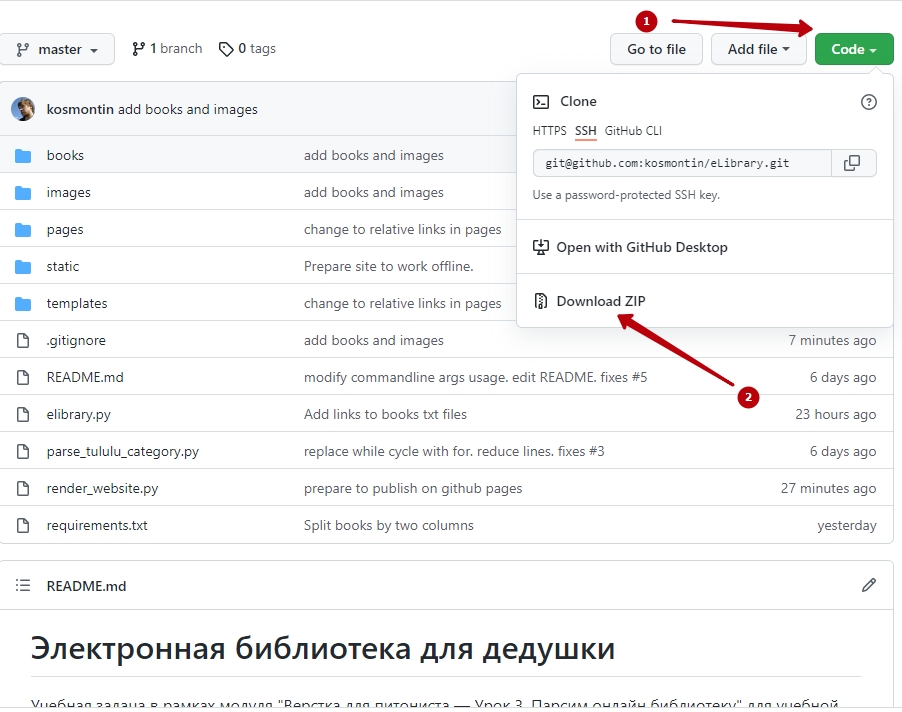

# Электронная библиотека для дедушки

Учебная задача в рамках модуля "Верстка для питониста — Урок 3. Парсим онлайн библиотеку" для учебной платформы [dvmn.org](https://dvmn.org)

Данный скрипт позволяет скачивать электронные книги с сайта [tululu.org](https://tululu.org/) в формате *.txt,
описание, комментарии и обложки книг. 

Полученные txt-файлы сохраняются в папку `books`, изображения в папку `images`.

Секция с научной фантастикой опубликована на GiHub Pages по следующей [ссылке](https://kosmontin.github.io/eLibrary/pages).

Для оффлайн-доступа к книгам серии скачайте данный репозиторий удобным вам способом.

Например так:


После скачивания, распакуйте архив. В папке `pages` откройте файл `index.html`   


# Подготовка к использованию

Для запуска необходимо следующее:
- Установленный Python 3
- Установлены зависимости командой `pip install -r requirements.txt`

# Использование

Для запуска скрипта необходимо воспользоваться командой:
```
python elibrary.py [--start_page] [--end_page] [--dest_folder] [--skip_imgs] [--skip_txt] [--json_path]
```

### Параметры:
- `--start_page` указатель на номер первой страницы. По умолчанию `1`
- `--end_page` указатель на номер последней страницы. По умолчанию соответствует значению параметра `--start_page`
- `--dest_folder` путь до папки с результатами работы скрипта
- `--skip_imgs` пропускать скачивание обложек книг. По умолчанию — `False` 
- `--skip_txt` пропускать скачивание книг в формате txt. По умолчанию — `False`  
- `--json_path` путь до расположения json-файла

### Примеры искользования параметров:
`python elibrary.py --start_page 700` скачать все книги, начиная с 700 по последнюю сраницу  

`python elibrary.py --start_page 600 --end_page 650` скачать все книги в диапазоне 600 по 650 страницы 

`python elibrary.py --end_page 7` скачать все книги, начиная с 1 по 7 страницу

`python elibrary.py --skip_imgs` скачать все книги, не скачивая обложки

`python elibrary.py --dest_folder c:\Books` скачать все книги и сохранить структуру в папке `c:\Books`  

### Файловая структура по умолчанию
```
project
│   README.md
│   elibrary.py
│   parse_tululu_category.py
│   requirements.txt
│   books_info.json
│
└───static
│   │   1. favicon.ico
│   │   2. how_to_download.jpg
│
└───images
│   │   1. file1.txt
│   │   2. file2.txt
│
└───pages
│   │   1. file1.txt
│   │   2. file2.txt
│
└───templates
│   │   card_template.html
│
└───books
    │   1. file1.txt
    │   2. file2.txt
```
 
